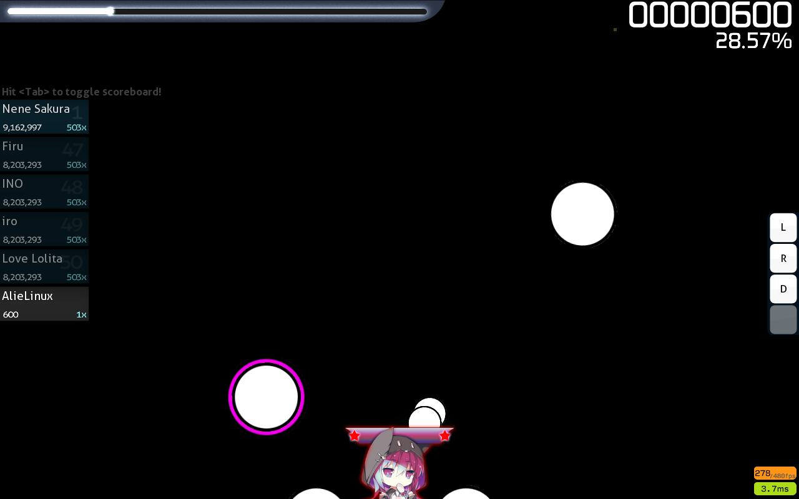

# hello World And welcome to my awesome Profile Boom

## about me:
<h3>What is my hobby?</h3>

programming: because it makes me excited(no not that kind of excited)

 

## Pronouncation:

Anything you Want

 

# also:

# my favorite game:

<!--
**troy600/troy600** is a ✨ _special_ ✨ repository because its `README.md` (this file) appears on your GitHub profile.

Here are some ideas to get you started:

- 🔭 I’m currently working on ...
- 🌱 I’m currently learning ...
- 👯 I’m looking to collaborate on ...
- 🤔 I’m looking for help with ...
- 💬 Ask me about ...
- 📫 How to reach me: ...
- 😄 Pronouns: ...
- ⚡ Fun fact: ...
-->
